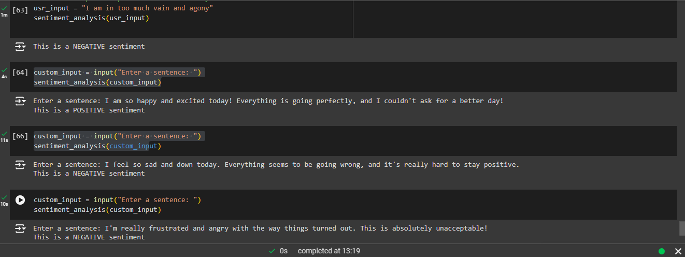

# Sentiment Analysis using NLP and RandomForestClassifier

## Project Overview

This project is a **Sentiment Analysis** tool built using **Natural Language Processing (NLP)** techniques and a **RandomForestClassifier** to classify text which are in different tones of: _joy, surprise, love, anger, sadness and hate_ into **positive** or **negative** sentiments. The project trains the model using labeled data and evaluates it on a separate test set, achieving an accuracy of approximately **~96%**.

### Key Features:
- **Text Preprocessing**: Removes stopwords, performs lemmatization, and transforms text into a format suitable for model training.
- **Vectorization**: Converts preprocessed text data into numerical features using **CountVectorizer** with bigrams (1,2 n-grams).
- **Model Training**: Utilizes a **RandomForestClassifier** to build the sentiment classification model.
- **User Input Testing**: Allows users to input custom text to predict sentiment in real-time.
- **Model Evaluation**: The model's performance is evaluated using **accuracy score**, confusion matrix, precision, recall, and F1-score.

Dataset

The dataset used for training contains labeled text data with binary sentiment labels:
- 1 for positive sentiment (e.g., joy, love, surprise).
- 0 for negative sentiment (e.g., anger, fear, sadness).

### Correction
If using the latest version of scikit-plot make sure to:
modify the **scikit-plot** library to use **numpy.interp** instead of **scipy.interp.** Here’s how you can do it if you are using google colab:
-Navigate to the directory where the scikit-plot package is installed (usually inside /usr/local/lib/python3.10/dist-packages/scikitplot/).
-Open the metrics.py file.
Replace _line 27_:


     from scipy import interp 

with

      from numpy import interp.

Future Enhancements
- Implementing additional NLP techniques such as TF-IDF vectorization.
- Exploring other machine learning models like SVM or Neural Networks for performance comparison.
- Expanding the dataset for multi-class sentiment analysis.

Conclusion

This project successfully demonstrates how to build a sentiment analysis model using NLP and machine learning techniques. With a solid 96% accuracy, the model can be further enhanced with more sophisticated features or larger datasets.

Feel free to clone this repository and experiment with the model!

## Results

The model was tested with custom user input, and it successfully classified both positive and negative sentiments. The accuracy of the model on the test dataset was around **96%**, demonstrating the effectiveness of the model for sentiment analysis tasks.

### Example of User Input Test:


The above image shows a successful classification of user input using the trained sentiment analysis model.

## How to Use

1. **Install Dependencies**:
   Ensure you have all required libraries by running:
   ```bash
   pip install -r requirements.txt
